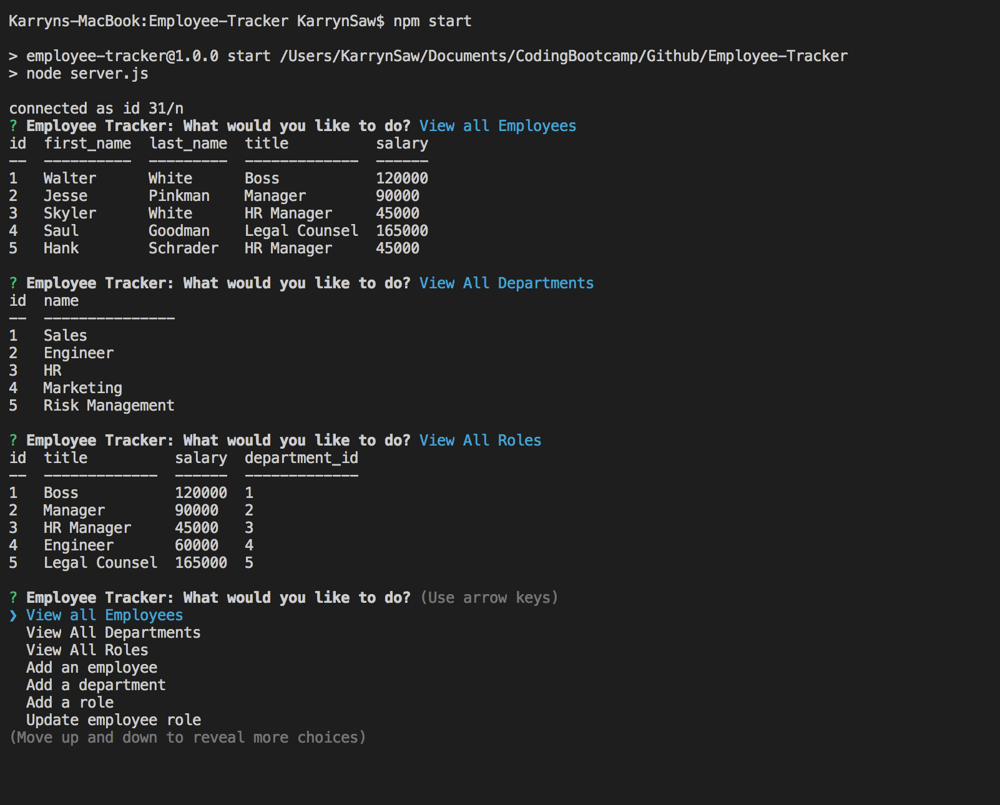

# Employee-Tracker

## Table of Contents
[Description](#Description)  
[Installation](#Installation)  
[Usage](#Usage)  
[License](#License)  
[Contributing](#Contributing)  
[Tests](#Tests)  
[Questions](#questions)

https://drive.google.com/file/d/1aBkEXWRnTvBFzcb40cxsyagBeSSDWhyw/view

## Description
A CLI application that allows for easier management of a company's employess. Features include viewing, adding and deleting employees, departments and roles as well as updating employee roles.

Techonologies utilised :  Node.js, inquirer and mySQL.

## Installation
Clone the package and inside the package directory install (npm i) all dependencies via terminal into your local folder.

## Usage
After installation, enter 'npm start' into the command line to run the application.
 
<a href="https://drive.google.com/file/d/1aBkEXWRnTvBFzcb40cxsyagBeSSDWhyw/view"> Link to Demo Video</a>
 

## License

## Contributing
To contribute please refer to https://github.com/microsoft/vscode/wiki/How-to-Contribute

## Tests

## Questions
Please direct questions to the following email: karrynsaw@gmail.com

Github: https://github.com/KarrynS
    